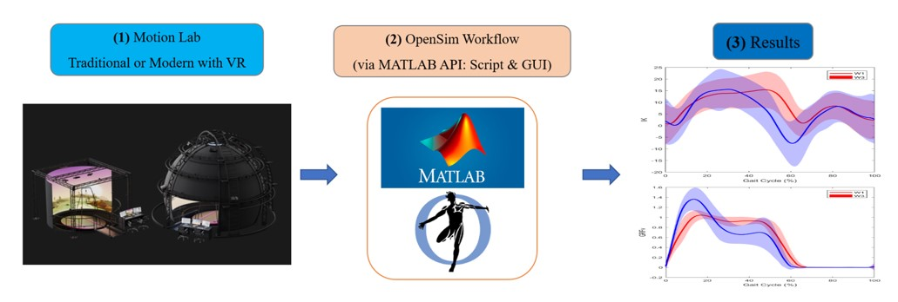

<h1>Introduction</h1> 

This report presents how to use collected data (C3D files) from any motion capture (MoCap) lab particularly CAREN lab (Motek Medical BV, Netherlands), bring it in MATLAB using OpenSim API, and then use (trc and mot) or (marker) data to scale the generic model, apply inverse kinematics and inverse dynamic processes. The optimization methods (e.g. Static Optimization or CMC) were used for predicting muscle forces/activations (as suggested by OpenSim) while validating each step. The toolkit aims to simplify the process so that the users only make minor changes to use the whole process in their lab. It should be noted that we use this based on CAREN lab data, however, this process can be used in any lab as mentioned above with some changes to the scripts. The toolbox assumes the full body human data is collected in the lab as C3D files (HBM markerset). 

Find this link below for more details: <a href="https://simtk-confluence.stanford.edu/display/OpenSim/Understanding+the+OpenSim+Pipeline">Link</a>

<b>Brief intro to the process and details are below it.</b> 

<table>
  <tr>
    <th>Processes</th>
    <th>Details</th>
  </tr>
  <tr>
    <td>Data cleaning and ready for OpenSim (very important)</td>
    <td>This is a very iterative process. Before even we enter data in Matlab, we need to make sure C3D and other relevant files are ready and clean for further processing (NaNs, missing data, Files name, …)</td>
  </tr>
  <tr>
    <td>C3D to OpenSim to create .trc and .mot files</td>
    <td>Using c3dExport.m (in <a href="https://github.com/hmok/CAREN/blob/master/OpenSim_v4.3/Matlab/mFiles/mFiles.zip">Link</a>), we export all C3D files into OpenSim 4.3.</td>
  </tr>
  <tr>
    <td>Visualize the experimental data</td>
    <td>Using OpenSim GUI, we can visualize our data. This can be done via Matlab as well. Take note that GRF and Markers will have a shift for visualization only, but the data has been correctly imported.</td>
    </tr>
  <tr>
    <td>Scaling the generic Model in OpenSim</td>
    <td>Scaling the OpenSim generic model needs proper marker-set definition, weights, etc. This step uses static pose data. 

See this <a href="https://www.youtube.com/watch?v=ZG7wzvQC6eU">Link</a>.</td>
    </tr>
  <tr>
    <td>Inverse Kinematics</td>
    <td>Dynamics TRC files will be used to do the inverse kinematics, I have finalized a code to do it in batch format. See details here <a href="https://simtk-confluence.stanford.edu/display/OpenSim/Getting+Started+with+Inverse+Kinematics">Link</a></td>
    </tr>
  <tr>
    <td>Inverse Dynamics</td>
    <td>Inverse dynamics provides generalized joint moments. So, the methods expanded here on OpenSim API will process all files. </td>
  <tr>
    <td>Static Optimization</td>
    <td>We used the following process using OpenSim API in MATLAB to assess muscle forces. <a href="https://simtk-confluence.stanford.edu/display/OpenSim/Static+Optimization">Link</a> </td>  
  <tr>
    <td><b>Next step </b> and especially validation: Is My Model Good Enough?</td>
    <td>We need to make sure our models are good enough. So how can we do it? Use this guideline below:
(Hicks, Uchida, Seth, Rajagopal, & Delp, 2015). 
</td>   
</table>

<h2>OpenSim Pipeline</h2> 

The pipeline for the toolbox involves the initial gathering of the 3D data with CAREN Lab. The C3D data output file will then go through the OpenSim Workflow via Matlab and can take two paths: Scripting (executing original code) or through a GUI (simplified app). The output of both processes will be plots of the results of the desired biomechanical variables. More information regarding the entire process is described in the Appendix.

<b>A quick setup to use CAREN2OpenSim toolkit in Matlab:</b> 

When C3D files are collected in the lab and cleaned up in e.g., Nexus, then the following simple steps will generate all the required outcomes from the OpenSim workflow (scaling-IK-ID-RRA-SO-CMC, etc.). We have tested this toolbox with OpenSim v.4.3, however, the very recent version v.4.4 (July 2022) should be fine with the process as well. 

<b>Steps to run the toolbox:</b> 
<ol>
  <li>Download the package from GitHub: <a href="https://github.com/hmok/CAREN/tree/master/OpenSim_v4.3/Matlab">Link</a> </li>
  <li>Download and install MATLAB and relevant toolbox (‘DSP System Toolbox’ and ‘Signal Processing Toolbox’) on your computer if you do not have it installed. We have tested the toolbox in version R2022a</li>
  <li>Install OpenSim API in MATLAB by following these steps: <a href="https://simtk-confluence.stanford.edu:8443/display/OpenSim/Scripting+with+Matlab">Link</a> </li>
  <ol>
    <li>Copy the mFiles located in (<a href="https://github.com/hmok/CAREN/tree/master/OpenSim_v4.3/Matlab/mFiles">Link</a>) into this directory on your device (C:/Users/<username>/Documents/OpenSim/4.x/Code/Matlab)</li>
    <li>Download the OpenSim_requirements zip into your device.</li>
  </ol>
  <li>Open the following file c3d2OpenSim.m and make the following:</li>
  <ol>
    <li>In Section 0 (Ln61) of c3d2OpenSim.m, named <b>‘Changing paths and destinations’</b>: </li>
    <ol>
      <li>add the path to your mFiles (same directory as the files in Step 3a)</li>
      <li>change the destination to your data folder</li>
      <li>add a path to the OpenSim requirement folders</li>
    </ol>
    <li>Create a folder called (C3DFiles) then make a copy of all the C3D files into it</li>
  </ol>  
  <li>Then you can easily run the rest of c3d2OpenSim.m and get all the results, as we have provided some sample C3D files here.</li>
</ol>
